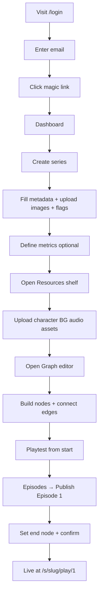
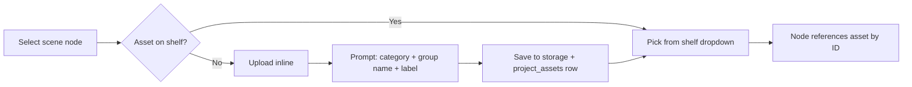
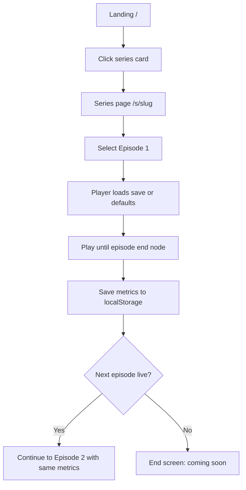
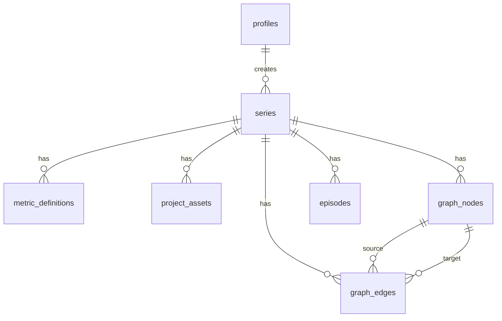

# Arleco — Detailed Design Specification

**Product:** Arleco  
**Studio:** Arius Interactive  
**Document version:** 0.3 (Draft)  
**Target ship:** 4 weeks from project start  
**Status:** Pre-implementation  

---

## Table of contents

1. [Executive summary](#1-executive-summary)
2. [Product vision & principles](#2-product-vision--principles)
3. [User roles & personas](#3-user-roles--personas)
4. [MVP scope (Month 1)](#4-mvp-scope-month-1)
5. [Future phases (post-MVP)](#5-future-phases-post-mvp)
6. [Information architecture](#6-information-architecture)
7. [User flows](#7-user-flows)
8. [Screen specifications](#8-screen-specifications)
9. [Series & episode model](#9-series--episode-model)
10. [Graph editor specification](#10-graph-editor-specification)
11. [Node & edge data formats](#11-node--edge-data-formats)
12. [Project resources shelf](#12-project-resources-shelf)
13. [Metrics, flags & player persistence](#13-metrics-flags--player-persistence)
14. [VN web player](#14-vn-web-player)
15. [Authentication & authorization](#15-authentication--authorization)
16. [Database schema](#16-database-schema)
17. [Storage layout](#17-storage-layout)
18. [API & server actions](#18-api--server-actions)
19. [Content flags taxonomy](#19-content-flags-taxonomy)
20. [Visual design system](#20-visual-design-system)
21. [Technical architecture](#21-technical-architecture)
22. [Security & RLS policies](#22-security--rls-policies)
23. [Non-functional requirements](#23-non-functional-requirements)
24. [Risks & mitigations](#24-risks--mitigations)
25. [Open questions](#25-open-questions)
26. [Appendix: Glossary](#26-appendix-glossary)

---

## 1. Executive summary

### 1.1 What we are building

A **browser-first visual novel platform** where creators build branching stories on a graph editor, organize art/audio in a project resource shelf, and **publish episodic chapters** to a public reader experience — similar to how WEBTOON Canvas publishes to WEBTOON readers.

Month 1 delivers the **creator studio** (login, series setup, graph editor, resources, publish) and a **public web reader** (landing, series pages, episode player). Monetization (reader ads, creator homepage promos, asset store) is intentionally deferred.

### 1.2 Primary goal (Month 1)

> A creator can sign in, create a series with listing metadata, build a branching VN on a graph using project assets, define metrics that persist across episodes, publish Episode 1, and a reader can play it on the public site without creating an account.

### 1.3 Product name

**Name:** **Arleco** *(pronounced SCEE-nah)*

From *scene* / stage — reader-friendly, episodic, and neutral enough for both cozy and grimdark series.

**Tagline (draft):** *Stories you choose.*

| Usage | Value |
|-------|-------|
| Public brand | Arleco |
| Studio credit | Arleco by Arius Interactive |
| Internal repo | `scena` |
| Package / env prefix | `scena` (e.g. `scena-dev`, `SCENA_*` env vars) |
| Domain (TBD) | `scena.app`, `scena.io`, or `readscena.com` — confirm availability before scaffold |

---

## 2. Product vision & principles

### 2.1 Long-term vision

| Layer | Description |
|-------|-------------|
| **Studio (web)** | Graph editor, resource shelf, series/episode management, publish |
| **Reader (web → native apps)** | Browse, subscribe to series, play episodic VNs |
| **Marketplace (later)** | Asset creators sell sprites/backgrounds to VN creators |
| **Monetization (later)** | Reader ads between episodes; creators buy homepage promotion slots |

### 2.2 Design principles

1. **Creators free to publish** — no paywall on publishing in the mature product.
2. **Readers pay, not creators** — ads/coins fund the platform long-term.
3. **Procreate-friendly** — PNG upload workflow; no Unity required for platform VNs.
4. **One graph per series** — episodes are published *ranges* of a single story graph, not separate projects.
5. **Metrics carry forward** — player state persists across episodes within a series.
6. **Don't build auth from scratch** — Supabase magic link only for MVP.
7. **Ship thin, iterate** — three node types in v1; validation and polish in v2.

### 2.3 Explicit non-goals (Month 1)

- Export to itch.io / standalone `.exe`
- Native iOS/Android reader apps
- Asset store / third-party seller accounts
- Reader login accounts
- In-episode or platform ads
- Coin wallet / Fast Pass
- Unity ABS Engine import/export
- Parallax layers, inventory/items, New Game Plus
- Full soft-lock validation parity with Unity engine
- Comments, social features, recommendation algorithm
- Real-time collaboration

---

## 3. User roles & personas

### 3.1 Role matrix

| Role | MVP | Auth required | Primary actions |
|------|-----|---------------|-----------------|
| **Reader** | ✅ | No | Browse, play episodes |
| **VN Creator** | ✅ | Yes (magic link) | Create series, edit graph, publish |
| **Asset Creator** | ❌ Phase E | Yes | Sell asset packs (future) |
| **Admin** | ✅ (manual) | Yes | Moderation, featured curation (via DB/dashboard) |

### 3.2 Personas

#### P1 — Procreate VN creator ("Mira")
- Illustrates characters in Procreate, exports PNG layers.
- Wants branching romance VN without learning Unity.
- Publishes weekly episodes like a webtoon.
- **Needs:** easy asset upload, graph for routes, metric gating for romance paths.

#### P2 — Reader ("Jordan")
- Reads on phone browser during commute.
- No interest in creating; won't make an account for MVP.
- **Needs:** fast load, tap-to-advance, clear episode list, content warnings visible.

#### P3 — ABS power user ("Dev") — future
- Uses Unity ABS VN Engine for complex projects.
- May use platform for mobile serial release only.
- **Needs:** import/export compatibility (Phase 2+).

---

## 4. MVP scope (Month 1)

### 4.1 Feature checklist

| ID | Feature | Priority | Week |
|----|---------|----------|------|
| F01 | Magic-link creator login | P0 | 1 |
| F02 | Creator dashboard (my series) | P0 | 1 |
| F03 | Create/edit series metadata | P0 | 1 |
| F04 | Content flags on series | P0 | 1 |
| F05 | Metric definitions per series | P0 | 1 |
| F06 | Project resources shelf | P0 | 2 |
| F07 | Auto-add assets used in graph to shelf | P0 | 2 |
| F08 | Graph editor (React Flow) | P0 | 2–3 |
| F09 | Scene nodes (dialogue, sprites, BG, audio) | P0 | 2–3 |
| F10 | Choice nodes with labeled branches | P0 | 3 |
| F11 | Logic nodes (set metrics/flags) | P1 | 3 |
| F12 | Conditional choice gates (metric thresholds) | P1 | 3 |
| F13 | In-editor playtest (single node or from start) | P1 | 3 |
| F14 | Web VN player | P0 | 3 |
| F15 | Player save via localStorage | P0 | 3 |
| F16 | Cross-episode metric persistence | P0 | 3–4 |
| F17 | Episode list + publish flow | P0 | 4 |
| F18 | Public landing (published series grid) | P0 | 4 |
| F19 | Public series detail page | P0 | 4 |
| F20 | Public episode player route | P0 | 4 |

**P0** = must ship. **P1** = ship if Week 3 on track; otherwise defer to Week 4 or v1.1.

### 4.2 Definition of done (launch)

- [ ] Deployed production URL on Vercel + Supabase
- [ ] At least 1 demo series published by Arius Black Studios
- [ ] 2–3 invited beta creators can publish without manual DB edits
- [ ] Reader can complete Episode 1, refresh, resume with same metrics
- [ ] Reader can play Episode 2 with metrics from Episode 1 intact
- [ ] Mobile-responsive player (375px width minimum)

---

## 5. Future phases (post-MVP)

| Phase | Timeline | Deliverables |
|-------|----------|--------------|
| **B** | Month 2 | Reader accounts, cloud saves, basic comments |
| **C** | Month 2–3 | Creator homepage promo slots (Stripe) |
| **D** | Month 3 | Reader ads between episodes |
| **E** | Month 3–4 | Asset store (seller role, Stripe Connect) |
| **F** | Month 4–6 | iOS/Android reader apps (React Native) |
| **G** | Month 6+ | Coin/Fast Pass, analytics dashboard, graph validation v2 |

---

## 6. Information architecture

```
Public
├── /                           Landing (published series grid)
├── /s/[slug]                   Series detail
└── /s/[slug]/play/[episode]    Episode player

Auth
└── /login                      Magic link request + callback

Creator (authenticated)
├── /dashboard                  My series
├── /series/new                 Create series wizard
├── /series/[id]                Redirect → graph (or overview)
├── /series/[id]/settings       Metadata, flags, metrics
├── /series/[id]/resources      Project resource shelf
├── /series/[id]/graph          Graph editor (primary workspace)
└── /series/[id]/episodes       Episode management + publish
```

---

## 7. User flows

### 7.1 Creator: first-time publish



### 7.2 Creator: add assets while editing



### 7.3 Reader: play episodic series



### 7.4 Publish episode

1. Creator opens **Episodes** tab.
2. Clicks **Publish new episode**.
3. System suggests `episode_number = max(existing) + 1`.
4. Creator enters episode title.
5. Creator selects **start node** (default: story entry for Ep1; previous end node for Ep2+).
6. Creator selects **end node** (cliffhanger / stop point).
7. System validates: start/end exist, end reachable from start (basic path check — optional v1.1).
8. Creator previews episode range.
9. Creator confirms → `episodes.is_live = true`, `published_at = now()`.
10. Episode appears on public series page.

---

## 8. Screen specifications

### 8.1 Landing `/`

**Purpose:** Discovery entry for readers.

| Section | Content |
|---------|---------|
| Header | Arleco logo, "Creator Login" link |
| Hero | Tagline (*Stories you choose.*) + optional featured series (manual `featured = true` flag) |
| Grid | Published series cards: thumbnail, title, short description, content flag chips |
| Footer | "Arleco by Arius Black Studios", terms placeholder |

**Series card data:** `thumbnail_url`, `title`, `short_description`, `content_flags[]`, `slug`

**Empty state:** Single demo series from Arius Black Studios.

---

### 8.2 Login `/login`

| Element | Behavior |
|---------|----------|
| Email input | Validates format |
| Submit | Calls Supabase `signInWithOtp` |
| Success message | "Check your email for a login link" |
| Callback | Supabase redirect → `/dashboard` |

No passwords. No sign-up vs login distinction — first login creates profile.

---

### 8.3 Dashboard `/dashboard`

| Element | Behavior |
|---------|----------|
| Header | User display name, logout |
| Primary CTA | "New series" |
| Series list | Cards: thumbnail, title, status (draft / has published episodes), last edited |
| Row actions | Open graph, settings, view public page (if any episode live) |

---

### 8.4 Create / edit series settings `/series/new`, `/series/[id]/settings`

**Single-page form (not multi-step wizard for MVP).**

| Field | Type | Required | Notes |
|-------|------|----------|-------|
| Title | text | ✅ | Max 80 chars |
| Slug | text | ✅ | Auto from title, editable, unique, URL-safe |
| Short description | textarea | ✅ | Max 160 chars — grid card blurb |
| Long description | rich text (plain markdown ok) | ✅ | Series detail page body |
| Thumbnail | image upload | ✅ | Recommended 400×600 PNG/JPG |
| Banner | image upload | ✅ | Recommended 800×400 or 800×1200 — series hero |
| Content flags | multi-select chips | ✅ min 0 | See §19 |
| Status | read-only | — | Draft until first episode published |

**Metric definitions section (same page or tab):**

| Column | Type |
|--------|------|
| Key | snake_case identifier, unique per series |
| Display name | Human label (optional for hidden metrics) |
| Default value | number, default 0 |
| Min / Max | optional bounds |
| Hidden | boolean — if true, player UI omits this metric |

Actions: Add row, Delete row, Save.

---

### 8.5 Project resources `/series/[id]/resources`

**Layout:** Left sidebar (categories) + main grid/list + upload dropzone.

#### Categories (tabs)

| Tab | Grouped by | Sort |
|-----|------------|------|
| Character sprites | Character name | Label alphabetically |
| Backgrounds | Scene name | Label alphabetically |
| Special effects | — (flat) | Upload date |
| Audio | — (flat) | Upload date |

#### Asset card

- Thumbnail (or waveform icon for audio)
- Label (e.g. `happy`, `cafe_night`)
- Group name subtitle (e.g. `Mira`, `School hallway`)
- "Used in N nodes" badge (optional v1.1)
- Actions: Rename, Delete (warn if referenced), Copy asset ID

#### Upload flow

1. Drag-drop or file picker (PNG, JPG, WebP for images; MP3, OGG for audio).
2. Modal: pick category → enter group name (if applicable) → enter label.
3. Upload to Supabase Storage → insert `project_assets` row.

**Max file size (MVP):** 10 MB per file.

---

### 8.6 Graph editor `/series/[id]/graph`

**Layout:**

```
┌─────────────────────────────────────────────────────────────┐
│ Toolbar: Save status | Add Scene | Add Choice | Add Logic   │
│          | Validate (stub) | Playtest from start | Episodes │
├──────────────────────────────┬──────────────────────────────┤
│                              │                              │
│   React Flow canvas          │   Inspector panel            │
│   (pan/zoom/drag nodes)      │   (selected node properties) │
│                              │                              │
├──────────────────────────────┴──────────────────────────────┤
│ Optional: minimap (v1.1)                                      │
└─────────────────────────────────────────────────────────────┘
```

#### Canvas interactions

| Action | Input |
|--------|-------|
| Pan | Two-finger drag / middle mouse / space+drag |
| Zoom | Pinch / scroll wheel |
| Move node | Drag node |
| Select node | Click |
| Create edge | Drag from choice handle to target node |
| Delete node/edge | Select + Delete key (confirm if node has connections) |
| Add node | Toolbar button → placed at viewport center |

#### Node visual encoding

- **Scene:** Rounded rectangle; border color = primary character color (if set).
- **Choice:** Diamond or hex shape; shows choice count.
- **Logic:** Small circle/diamond, muted color.

#### Inspector panel (context-sensitive)

Shown when a node is selected. See §11 for field lists.

#### Autosave

- Debounced save (500ms) on graph changes to `graph_nodes` + `graph_edges`.
- "Saved" / "Saving…" indicator in toolbar.

---

### 8.7 Episodes `/series/[id]/episodes`

| Column | Content |
|--------|---------|
| # | Episode number |
| Title | Episode title |
| Start → End | Node labels or IDs (truncated) |
| Status | Draft / Live |
| Published | Date or "—" |
| Actions | Preview, Publish/unpublish, Edit bounds |

**Publish modal:** See §7.4.

**Unpublish:** Sets `is_live = false`; episode hidden from public, player returns 404 for that episode number.

---

### 8.8 Series detail (public) `/s/[slug]`

| Section | Content |
|---------|---------|
| Banner image | Full-width hero |
| Title + short description | |
| Content flags | Visible warning chips |
| Long description | |
| Episode list | Numbered buttons; locked icon if not yet live (hidden entirely for MVP — only show live episodes) |
| Creator name | Display name from profile |

---

### 8.9 Episode player (public) `/s/[slug]/play/[episode]`

Full-screen immersive player. See §14.

---

## 9. Series & episode model

### 9.1 Hierarchy

```
Series (1)
├── Metric definitions (0..n)
├── Project assets (0..n)
├── Graph nodes (1..n)
├── Graph edges (0..n)
└── Episodes (1..n published ranges)
```

### 9.2 One graph, many episodes

The **entire story** lives in one graph per series. Episodes are **contiguous published segments**:

- **Episode 1:** `start_node` = designated story entry node; `end_node` = cliffhanger.
- **Episode 2+:** `start_node` typically equals previous episode's `end_node` (or next node along main path); new `end_node` selected by creator.

The player **only traverses nodes between start and end** for the current episode. When the end node is reached, show episode complete screen.

### 9.3 Story entry node

Each series has exactly one node flagged `is_entry = true` (or derived: node with no incoming edges designated at publish time). Set during Episode 1 publish if not already defined.

---

## 10. Graph editor specification

### 10.1 Node types

| Type | `node_type` | Max connections out | Purpose |
|------|-------------|---------------------|---------|
| Scene | `scene` | 1 default (linear); optional branch via separate Choice node | Dialogue + visuals |
| Choice | `choice` | 2–4 labeled | Branching decisions |
| Logic | `logic` | 1 | Metric/flag updates, no UI dialogue |

**Design rule:** Branching happens at **Choice** nodes, not implicit multi-output Scene nodes (keeps Unity ABS mental model clean).

### 10.2 Edge rules

| From | To | Edge metadata |
|------|-----|---------------|
| Scene | Scene | — |
| Scene | Choice | — |
| Scene | Logic | — |
| Choice | Scene/Logic | `choice_label`, optional `condition` |
| Logic | Scene/Choice | — |

### 10.3 Conditions (MVP)

JSON on edge or choice option:

```json
{
  "type": "metric_gte",
  "metric_key": "mira_affection",
  "value": 5
}
```

If condition fails, choice option is **hidden** (not grayed — hidden is simpler for MVP).

Future: `metric_lte`, `flag_set`, `flag_not_set`, compound AND/OR.

### 10.4 Playtest modes

| Mode | Behavior |
|------|----------|
| From start | Opens player overlay at entry node |
| From selected node | Opens player overlay at selected node (ignores episode bounds) |

Playtest uses in-memory metrics; does not write to localStorage.

---

## 11. Node & edge data formats

### 11.1 Graph node (DB: `graph_nodes.data` JSONB)

**Common fields:**

```typescript
interface GraphNode {
  id: string;              // UUID, matches graph_nodes.id
  node_type: 'scene' | 'choice' | 'logic';
  position: { x: number; y: number };
  label?: string;          // Editor-only display name
  is_entry?: boolean;
  primary_character_id?: string; // For border color
}
```

**Scene node `data`:**

```typescript
interface SceneNodeData {
  lines: DialogueLine[];
  background_asset_id: string | null;
  sprites: {
    left: string | null;   // project_assets.id
    center: string | null;
    right: string | null;
  };
  audio: {
    bgm_asset_id: string | null;
    bgm_action: 'play' | 'stop' | 'continue'; // continue = keep previous
    sfx_asset_id: string | null;
  };
  transition: 'cut' | 'fade'; // MVP: cut only is acceptable
}

interface DialogueLine {
  speaker: string;         // Display name or "Narrator"
  text: string;
  portrait_asset_id?: string | null; // Optional override per line
}
```

**Choice node `data`:**

```typescript
interface ChoiceNodeData {
  prompt?: string;         // Optional text above choices
  choices: ChoiceOption[];
}

interface ChoiceOption {
  id: string;
  label: string;
  target_node_id: string;  // Redundant with edge but aids editing
  condition?: MetricCondition | null;
}
```

**Logic node `data`:**

```typescript
interface LogicNodeData {
  operations: LogicOperation[];
}

interface LogicOperation {
  type: 'set_metric' | 'add_metric' | 'set_flag' | 'unset_flag';
  metric_key?: string;
  value?: number;
  flag_key?: string;
}
```

### 11.2 Graph edge (DB: `graph_edges`)

```typescript
interface GraphEdge {
  id: string;
  series_id: string;
  source_node_id: string;
  target_node_id: string;
  source_handle?: string;  // For choice option ID
  choice_label?: string;
  condition?: MetricCondition | null;
}
```

---

## 12. Project resources shelf

### 12.1 Asset record

```typescript
interface ProjectAsset {
  id: string;
  series_id: string;
  category: 'character' | 'background' | 'effect' | 'audio';
  group_name: string | null;  // Character or scene name; null for effect/audio
  label: string;
  storage_path: string;
  mime_type: string;
  width?: number;             // Images only
  height?: number;
  duration_ms?: number;       // Audio only
  created_at: string;
  created_by: string;
}
```

### 12.2 Auto-add on inline upload

When creator uploads via graph inspector:

1. File uploads to storage.
2. `project_assets` row created.
3. Asset immediately selected on triggering field.
4. Toast: "Added to Project Resources."

Creator must provide category + group + label in upload modal (same as shelf upload).

### 12.3 Referential integrity

- **Delete asset:** Block if any `graph_nodes.data` references `asset_id`; show list of dependent nodes.
- **Rename asset:** Allowed; updates display only (references by ID).

### 12.4 Character colors (for graph node borders)

Optional `character_profiles` table (v1.1) or store on first sprite upload:

```typescript
interface CharacterProfile {
  series_id: string;
  name: string;              // Matches group_name
  display_color: string;   // Hex
}
```

MVP fallback: hash character name to color in UI.

---

## 13. Metrics, flags & player persistence

### 13.1 Metric definition

```typescript
interface MetricDefinition {
  id: string;
  series_id: string;
  key: string;               // Unique per series, snake_case
  display_name: string;
  default_value: number;
  min_value: number | null;
  max_value: number | null;
  hidden: boolean;
}
```

### 13.2 Story flags (MVP)

Simple string set stored alongside metrics:

```typescript
flags: string[]  // e.g. ["met_mira", "has_key"]
```

Set/unset via Logic nodes.

### 13.3 Player progress (localStorage MVP)

**Key:** `scena_progress_{series_slug}`

```typescript
interface PlayerProgress {
  series_slug: string;
  last_episode_completed: number;
  current_node_id: string | null;
  metrics: Record<string, number>;
  flags: string[];
  updated_at: string;        // ISO timestamp
}
```

### 13.4 Cross-episode behavior

| Event | Behavior |
|-------|----------|
| Start Episode 1, no save | Initialize metrics from definitions; empty flags |
| Complete Episode 1 | Write save; set `last_episode_completed = 1` |
| Start Episode 2 | Load save; **do not reset metrics** unless Logic node explicitly sets values |
| Replay Episode 1 | Prompt: "Start over?" → resets progress for series |

### 13.5 Episode completion detection

Player reaches `episode.end_node_id` → show completion overlay → update `last_episode_completed` if this episode number ≥ saved value.

---

## 14. VN web player

### 14.1 Layout

```
┌────────────────────────────────────────┐
│  [Optional: metric bars if not hidden] │
│                                        │
│         Background image               │
│                                        │
│    [Left sprite] [Center] [Right]      │
│                                        │
├────────────────────────────────────────┤
│  Speaker name                          │
│  Dialogue text (typewriter optional)   │
│                          [Tap to adv.] │
└────────────────────────────────────────┘
```

### 14.2 Input

| Input | Action |
|-------|--------|
| Tap / click / Space | Advance dialogue line |
| After last line of Scene | Auto-advance to next node OR show choices |
| Choice selection | Apply edge condition check → navigate |

### 14.3 Runtime engine (client-side)

1. Fetch episode + graph subset (nodes/edges reachable from start to end) + assets URLs + metric definitions.
2. Initialize or load `PlayerProgress`.
3. Walk graph:
   - **Scene:** render lines sequentially.
   - **Choice:** render buttons for valid choices (conditions evaluated).
   - **Logic:** apply operations silently → immediate advance.
4. On end node: episode complete UI.

### 14.4 Preloading

- Preload background + sprites for current and next scene node when possible.
- Audio: play BGM on user gesture (browser autoplay policy — first tap unmutes).

### 14.5 Responsive

- 375px min width (iPhone SE).
- Sprites scale proportionally; text box fixed to bottom ~30% height.
- Touch targets ≥ 44px.

---

## 15. Authentication & authorization

### 15.1 Provider

**Supabase Auth** with email magic link (OTP).

### 15.2 Profile bootstrap

On first successful login, create `profiles` row:

```sql
insert into profiles (id, email, display_name)
values (auth.uid(), auth.email(), split_part(auth.email(), '@', 1));
```

Display name editable in dashboard settings (v1.1).

### 15.3 Authorization rules

| Resource | Reader | Creator (owner) | Creator (other) |
|----------|--------|-----------------|-----------------|
| Public published episodes | Read | Read | Read |
| Draft series/graph | — | CRUD | — |
| Publish episode | — | ✅ own series | — |

Row Level Security enforces `series.creator_id = auth.uid()` for all write operations.

---

## 16. Database schema

### 16.1 Entity relationship (overview)



### 16.2 Table definitions

#### `profiles`

| Column | Type | Notes |
|--------|------|-------|
| id | uuid PK | FK → auth.users.id |
| email | text | |
| display_name | text | |
| created_at | timestamptz | default now() |

#### `series`

| Column | Type | Notes |
|--------|------|-------|
| id | uuid PK | |
| creator_id | uuid FK → profiles.id | |
| slug | text UNIQUE | URL segment |
| title | text | |
| short_description | text | |
| long_description | text | |
| thumbnail_path | text | Storage path |
| banner_path | text | Storage path |
| content_flags | text[] | |
| entry_node_id | uuid NULL | FK → graph_nodes.id |
| created_at | timestamptz | |
| updated_at | timestamptz | |

#### `metric_definitions`

| Column | Type | Notes |
|--------|------|-------|
| id | uuid PK | |
| series_id | uuid FK | ON DELETE CASCADE |
| key | text | UNIQUE(series_id, key) |
| display_name | text | |
| default_value | numeric | default 0 |
| min_value | numeric NULL | |
| max_value | numeric NULL | |
| hidden | boolean | default false |

#### `project_assets`

| Column | Type | Notes |
|--------|------|-------|
| id | uuid PK | |
| series_id | uuid FK | |
| category | text | enum check |
| group_name | text NULL | |
| label | text | |
| storage_path | text | |
| mime_type | text | |
| metadata | jsonb | width, height, duration |
| created_at | timestamptz | |
| created_by | uuid FK | |

#### `graph_nodes`

| Column | Type | Notes |
|--------|------|-------|
| id | uuid PK | |
| series_id | uuid FK | |
| node_type | text | scene, choice, logic |
| position_x | numeric | |
| position_y | numeric | |
| label | text NULL | |
| data | jsonb | See §11 |
| updated_at | timestamptz | |

#### `graph_edges`

| Column | Type | Notes |
|--------|------|-------|
| id | uuid PK | |
| series_id | uuid FK | |
| source_node_id | uuid FK → graph_nodes | |
| target_node_id | uuid FK → graph_nodes | |
| source_handle | text NULL | |
| choice_label | text NULL | |
| condition | jsonb NULL | |

#### `episodes`

| Column | Type | Notes |
|--------|------|-------|
| id | uuid PK | |
| series_id | uuid FK | |
| episode_number | int | UNIQUE(series_id, episode_number) |
| title | text | |
| start_node_id | uuid FK → graph_nodes | |
| end_node_id | uuid FK → graph_nodes | |
| is_live | boolean | default false |
| published_at | timestamptz NULL | |
| created_at | timestamptz | |

---

## 17. Storage layout

**Bucket:** `series-assets` (public read for published content)

```
series-assets/
  {series_id}/
    listing/
      thumbnail.{ext}
      banner.{ext}
    assets/
      character/{group_name}/{label}.{ext}
      background/{group_name}/{label}.{ext}
      effect/{label}.{ext}
      audio/{label}.{ext}
```

**Draft series:** RLS on storage — public URLs only generated for assets belonging to series with ≥1 live episode, OR signed URLs for creator preview (implementation choice: signed URLs for all draft assets).

**MVP simplification:** Bucket public read; obscure UUID paths provide casual privacy for drafts.

---

## 18. API & server actions

Prefer **Next.js Server Actions** + Supabase client for MVP. REST API optional later.

### 18.1 Server actions (creator)

| Action | Input | Output |
|--------|-------|--------|
| `createSeries` | metadata | series id |
| `updateSeries` | series id, fields | success |
| `upsertMetricDefinitions` | series id, array | success |
| `uploadAsset` | series id, file, metadata | project_asset |
| `deleteAsset` | asset id | success / error if referenced |
| `saveGraph` | series id, nodes[], edges[] | success |
| `publishEpisode` | series id, episode metadata | episode |
| `unpublishEpisode` | episode id | success |

### 18.2 Public data fetching (RSC or route handlers)

| Endpoint | Returns |
|----------|---------|
| `GET /api/public/series` | Live series list for landing |
| `GET /api/public/series/[slug]` | Series metadata + live episodes |
| `GET /api/public/series/[slug]/episodes/[n]` | Episode bounds + graph payload + asset URLs |

Graph payload for player: server computes reachable subgraph between start/end nodes; strips editor-only fields.

---

## 19. Content flags taxonomy

Fixed list for MVP (stored as string array on `series.content_flags`):

| Flag key | Display label | Description |
|----------|---------------|-------------|
| `romance` | Romance | Romantic themes/relationships |
| `violence` | Violence | Physical violence |
| `horror` | Horror | Scary/disturbing content |
| `sexual_content` | Sexual content | Sexual themes (not explicit porn MVP policy TBD) |
| `strong_language` | Strong language | Profanity |
| `gore` | Gore | Graphic injury/blood |
| `substance_use` | Substance use | Drugs/alcohol depiction |
| `self_harm` | Self-harm themes | Sensitive mental health themes |

Display on series page as chips above episode list. No filtering on landing for MVP (v1.1: filter toggles).

**Platform policy placeholder:** Prohibit illegal content; manual moderation via admin flag on `series`.

---

## 20. Visual design system

> **Design philosophy:** *Neutral stage, colorful stories.*  
> Scena’s chrome is calm and modern — never cute, never grimdark. Series art and thumbnails supply all the personality.

### 20.1 Brand principles

| Principle | Meaning |
|-----------|---------|
| **Neutral canvas** | UI stays warm off-white / soft gray. No pink bubbles, no horror-black chrome. |
| **Content carries color** | Thumbnails, sprites, and CGs are the only saturated color on browse pages. |
| **Noticeable, not loud** | Brand reads through typography, a signature accent, and the stage-frame motif — not through theme skins. |
| **Two surfaces** | **Gallery** (public site — airy, editorial) vs **Studio** (creator tools — focused, utilitarian). |
| **Player is immersive** | In-episode UI may use dark overlays for readability; site chrome does not. |

### 20.2 Logo & wordmark

**Wordmark:** `Arleco` set in **Fraunces** (600 weight), tight tracking (`-0.02em`).

**Mark (icon):** A minimal **proscenium frame** — an open rectangle with a slightly wider top bar, suggesting a stage opening. Single stroke, no fill. Used alone at favicon sizes; paired with wordmark in header.

```
   ┌───────────────
   │               ╮
   │    SCENA      │  ← top bar heavier = “stage header”
   │               │
   └───────────────┘
```

**Clear space:** Height of the “S” around the mark on all sides.

**Don’t:** mascots, emoji, gradients on the logo, all-caps SHOUT, cute rounded letterforms.

### 20.3 Color tokens

#### Core palette (gallery + studio shell)

| Token | Hex | Usage |
|-------|-----|-------|
| `--scena-bg` | `#F7F6F3` | Page background (warm paper) |
| `--scena-surface` | `#FFFFFF` | Cards, panels, modals |
| `--scena-surface-2` | `#F0EFEC` | Studio sidebar, secondary panels |
| `--scena-text` | `#141414` | Primary text |
| `--scena-text-muted` | `#6B6B6B` | Secondary text, captions |
| `--scena-text-faint` | `#9A9893` | Placeholders, disabled |
| `--scena-border` | `#E5E3DE` | Dividers, card outlines |
| `--scena-border-strong` | `#C9C6BE` | Focus rings, active borders |

#### Brand accent (signature — use sparingly)

| Token | Hex | Usage |
|-------|-----|-------|
| `--scena-accent` | `#127A7A` | Primary CTA, logo mark stroke, active nav, links |
| `--scena-accent-hover` | `#0E6363` | Button hover |
| `--scena-accent-soft` | `#E6F3F3` | Selected row, subtle highlight backgrounds |
| `--scena-accent-muted` | `#127A7A20` | Focus ring (12% opacity) |

Teal reads as **stage / spotlight / composed** — distinct from Webtoon green, Tapas orange, and ABS VN Engine pink. Not cute, not horror.

#### Semantic (functional only)

| Token | Hex | Usage |
|-------|-----|-------|
| `--scena-success` | `#2D6A4F` | Published, saved |
| `--scena-warning` | `#B8860B` | Draft, unsaved |
| `--scena-error` | `#B83B3B` | Errors, destructive confirm |
| `--scena-info` | `#3D5A80` | Info callouts |

**Content flags** use muted outlined chips (`border` + `--scena-text-muted` text) — never genre-colored rainbow chips.

#### Player overlay (in-story only)

| Token | Hex | Usage |
|-------|-----|-------|
| `--scena-player-bar` | `#141414CC` | Dialogue box (80% opacity) |
| `--scena-player-text` | `#FAFAF8` | Dialogue on dark bar |

### 20.4 Typography

| Role | Font | Weight | Size (desktop) | Notes |
|------|------|--------|----------------|-------|
| **Wordmark** | Fraunces | 600 | 1.5rem | Logo only |
| **Display / H1** | Fraunces | 500 | 2.25–3rem | Landing hero, series title |
| **Heading H2–H3** | DM Sans | 600 | 1.25–1.5rem | Section titles |
| **Body** | DM Sans | 400 | 1rem (16px) | UI, descriptions |
| **Small / meta** | DM Sans | 500 | 0.8125rem (13px) | Ep numbers, dates, flags |
| **Player dialogue** | Literata | 400 | 1.0625rem (17px) | In-player text only — readable serif |

**Google Fonts import:**
`Fraunces`, `DM Sans`, `Literata` (player only).

**Scale:** 1.125 ratio. Body line-height `1.6`; headings `1.2`.

### 20.5 Spacing & layout

| Token | Value |
|-------|-------|
| Base unit | `4px` |
| Page max-width (gallery) | `1200px` |
| Page padding | `24px` mobile / `40px` desktop |
| Card gap (grid) | `24px` |
| Section spacing | `64px` vertical between major blocks |
| Border radius (cards, inputs) | `8px` — modern, not bubbly (`rounded-lg`) |
| Border radius (buttons) | `6px` |
| Border radius (pills / flags) | `999px` |

**Grid (landing):** Responsive card grid — `minmax(160px, 1fr)` mobile, `minmax(200px, 220px)` desktop. Portrait cards **3:4** aspect ratio (VN / serial fiction convention).

### 20.6 Signature motif — stage frame

Apply subtly so branding is recognizable without dominating:

- Series cards: `1px` border + **2px accent top edge** (`--scena-accent`) — reads as “stage header.”
- Empty graph canvas: dot grid on `--scena-surface-2`, nodes sit on white cards with thin border.
- Section dividers: optional thin accent line (24px wide) above H2s on marketing pages.
- Favicon: proscenium mark in accent teal on `--scena-bg`.

Stories never inherit this frame inside the player — full-bleed art only.

### 20.7 Components

#### Header (gallery)

```
[ ◻ Arleco ]                    Discover    Creator Login
```

- Height `64px`, white surface, bottom border `--scena-border`
- Wordmark left; minimal nav center/right
- Sticky on scroll with subtle `box-shadow: 0 1px 0 rgba(0,0,0,.06)`

#### Buttons

| Variant | Style |
|---------|-------|
| **Primary** | `--scena-accent` fill, white text, 6px radius |
| **Secondary** | White fill, `--scena-border-strong` border, `--scena-text` |
| **Ghost** | No border, `--scena-accent` text, hover `--scena-accent-soft` bg |

No gradients on buttons for MVP. No pill-shaped primary CTAs.

#### Series card

- 3:4 thumbnail (object-fit cover) — **thumbnail is the color**
- Title: DM Sans 600, 2 lines max, ellipsis
- Short description: muted, 2 lines
- Content flags: small outlined pills below
- Hover: lift `translateY(-2px)`, shadow `0 8px 24px rgba(20,20,20,.08)`, accent top bar brightens

#### Content flag chip

- `13px` DM Sans 500, `--scena-text-muted`
- Border `1px solid --scena-border`, padding `4px 10px`, pill radius
- No fill (outline only)

#### Creator studio shell

| Area | Treatment |
|------|-------------|
| Sidebar | `--scena-surface-2`, 240px, series nav + Resources / Graph / Episodes |
| Main | White, full remaining width |
| Graph toolbar | White bar, bottom border, icon + text labels |
| Inspector | Right panel 320px, white, left border |

Studio uses **DM Sans only** (no Fraunces) — work mode, not marketing mode.

#### Inputs

- White bg, `1px --scena-border`, radius `8px`, padding `10px 14px`
- Focus: `2px` ring `--scena-accent-muted`, border `--scena-accent`

### 20.8 Page templates

#### Landing `/`

1. **Header** — Arleco wordmark + Creator Login  
2. **Hero (compact)** — Fraunces H1: *Stories you choose.* One line subcopy. No illustration — whitespace is the hero.  
3. **Featured row** (optional, manual) — 1–3 larger cards with stage-frame accent  
4. **Discover grid** — all live series  
5. **Footer** — “Scena by Arius Black Studios”, links placeholder  

No carousel. No dark hero banner. No anime stock art in platform chrome.

#### Series detail `/s/[slug]`

- Wide **banner** (creator art) — full width, max-height `360px`, object-fit cover with gradient fade to `--scena-bg` at bottom
- Fraunces series title + muted flags + long description
- Episode list: clean numbered rows, primary CTA “Read Episode 1”

#### Player `/s/[slug]/play/[ep]`

- **Zero gallery chrome** — optional thin top bar (episode title + exit) auto-hides
- Full viewport background + sprites
- Dialogue bar bottom per §14

### 20.9 Motion

| Interaction | Duration | Easing |
|-------------|----------|--------|
| Card hover lift | `180ms` | `ease-out` |
| Page transitions | `200ms` | `ease` |
| Player dialogue advance | `120ms` fade | optional typewriter v1.1 |
| Modal open | `240ms` | scale 0.98→1 + fade |

No bounce, no confetti, no playful spring physics on platform chrome.

### 20.10 Tailwind / CSS variable mapping

```css
:root {
  --scena-bg: #F7F6F3;
  --scena-surface: #FFFFFF;
  --scena-surface-2: #F0EFEC;
  --scena-text: #141414;
  --scena-text-muted: #6B6B6B;
  --scena-border: #E5E3DE;
  --scena-accent: #127A7A;
  --scena-accent-hover: #0E6363;
  --scena-accent-soft: #E6F3F3;
  --font-display: "Fraunces", Georgia, serif;
  --font-ui: "DM Sans", system-ui, sans-serif;
  --font-player: "Literata", Georgia, serif;
}
```

shadcn/ui theme: map `primary` → `--scena-accent`, `background` → `--scena-bg`, `foreground` → `--scena-text`.

### 20.11 Accessibility (MVP baseline)

- Body text contrast ≥ 4.5:1 on `--scena-bg`
- Accent on white: `#127A7A` passes AA for large text and UI components
- Keyboard: Space to advance in player; visible focus rings on all interactive elements
- Alt text on series thumbnails (series title minimum)
- Content flags visible before play
- `prefers-reduced-motion`: disable card lift and nonessential fades

### 20.12 Error states

| Scenario | Message |
|----------|---------|
| Magic link expired | "Link expired. Request a new one." |
| Delete asset in use | "This asset is used in N nodes. Remove references first." |
| Publish without entry node | "Mark a story entry node before publishing." |
| Episode end unreachable | "End node is not reachable from start. Check your graph." (v1.1) |

### 20.13 Design reference

Open **`docs//`** in a browser for a static mock of the landing page, tokens, and components.

---

## 21. Technical architecture

```
┌─────────────────────────────────────────────────┐
│  Vercel                                         │
│  ┌───────────────────────────────────────────┐  │
│  │  Next.js 14 (App Router)                  │  │
│  │  - RSC for public pages                   │  │
│  │  - Client components: Graph, Player       │  │
│  │  - Server Actions for mutations           │  │
│  └───────────────────────────────────────────┘  │
└─────────────────────────────────────────────────┘
                        │
                        ▼
┌─────────────────────────────────────────────────┐
│  Supabase                                       │
│  - Auth (magic link)                            │
│  - PostgreSQL                                   │
│  - Storage (series-assets bucket)               │
│  - RLS policies                                 │
└─────────────────────────────────────────────────┘
```

### 21.1 Key dependencies

| Package | Purpose |
|---------|---------|
| `next` | Framework |
| `@supabase/supabase-js`, `@supabase/ssr` | Auth + DB + storage |
| `@xyflow/react` | Graph editor |
| `tailwindcss`, `shadcn/ui` | UI components |
| `zod` | Validation |
| `uuid` | Client-side IDs for optimistic graph edits |

### 21.2 Environments

| Env | Supabase project | URL |
|-----|------------------|-----|
| Development | scena-dev | localhost:3000 |
| Production | scena-prod | TBD (e.g. scena.app) |

---

## 22. Security & RLS policies

### 22.1 `series`

- SELECT: public if EXISTS live episode; OR creator_id = auth.uid()
- INSERT: authenticated, creator_id = auth.uid()
- UPDATE/DELETE: creator_id = auth.uid()

### 22.2 `graph_nodes`, `graph_edges`, `project_assets`, `metric_definitions`, `episodes`

- ALL: creator owns parent series
- SELECT public: only when fetching via public API for live episodes (server-side service role OR restricted view)

**MVP pattern:** Public player API uses Next.js server with service role to fetch published graph subset — avoids exposing draft graphs via RLS complexity.

### 22.3 Storage

- Upload: authenticated creator owns series folder
- Public read: enabled for MVP (see §17)

---

## 23. Non-functional requirements

| Requirement | Target |
|-------------|--------|
| Graph editor responsiveness | 60fps pan/zoom with ≤100 nodes |
| Player first paint | < 3s on 4G |
| Autosave latency | < 1s perceived |
| Uptime | Best effort (Vercel + Supabase free/pro tiers) |
| Browser support | Last 2 Chrome, Safari, Firefox, Edge; iOS Safari 15+ |
| Concurrent creators | 50 (MVP) |

---

## 24. Risks & mitigations

| Risk | Impact | Mitigation |
|------|--------|------------|
| Graph scope creep | Miss ship date | Lock 3 node types; defer validation |
| Auth complexity fear | Blocker | Supabase only; no custom passwords |
| Browser audio autoplay | Broken BGM | Require first tap; show unmute hint |
| Large PNG assets | Slow player | Recommend max 1920px; compress on upload (v1.1) |
| Draft graph leaked | Spoilers | Service role API for published subset only |
| Episode boundary bugs | Player stuck | Explicit end node + completion overlay |

---

## 25. Open questions

| # | Question | Owner | Decision by |
|---|----------|-------|-------------|
| Q1 | Final domain (`scena.app`, `scena.io`, etc.)? | Jade | Before repo scaffold |
| Q2 | Explicit content policy & moderation workflow? | Jade | Before beta invite |
| Q3 | Typewriter effect in player v1 or v1.1? | Dev | Week 3 |
| Q4 | Signed URLs vs public bucket for drafts? | Dev | Week 1 |
| Q5 | Allow multiple live episodes re-playable out of order? | Design | MVP: sequential only |
| Q6 | Markdown support in long description? | Dev | Week 1 — plain text ok for MVP |

---

## 26. Appendix: Glossary

| Term | Definition |
|------|------------|
| **Arleco** | The platform — browser studio + public reader for episodic visual novels |
| **Series** | A complete VN title; one graph; many episodes |
| **Episode** | A published chapter — a start/end range within the graph |
| **Scene node** | Dialogue + visuals |
| **Choice node** | Player decision point |
| **Logic node** | Silent metric/flag update |
| **Project resources** | All assets uploaded/used in a series |
| **Metric** | Numeric variable (e.g. affection) persisted for the player |
| **Flag** | Boolean story state (e.g. `met_mira`) |
| **Entry node** | Where Episode 1 begins |
| **Shelf** | UI for browsing project resources by category |

---

## Document history

| Version | Date | Author | Changes |
|---------|------|--------|---------|
| 0.1 | 2026-07-17 | Arius Black Studios / AI draft | Initial specification from planning sessions |
| 0.2 | 2026-07-17 | Arius Black Studios / AI draft | Product name set to **Arleco**; repo/env prefixes, localStorage key, branding updated |
| 0.3 | 2026-07-17 | Arius Black Studios / AI draft | Full visual design system (§20); `/` mock |

---

*Next step: Confirm domain (Q1), then scaffold Next.js + Supabase repo per §21.*
